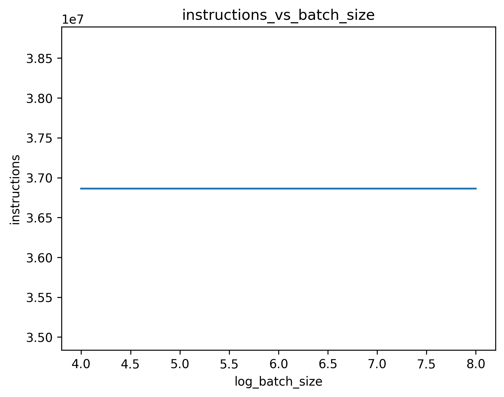

# CNN complexity analysis

# Time/Space Complexity of MNIST CNN
For a convolutional layer with kernel size $K * K * C$, input size $C$ and output size $M$, the complexity of this layer per image is $O(W * H * K^2 * C * M)$, where $W$ and $H$ are the input image size. In particular, for `conv2` layer, we can compute the number of operations needed for a picture input from MINIST dataset. After `conv1`, the input size of `conv2` is $26 * 26$. The number of addtions and multiplications per kernel per position is $3*3 * 2 = 18$. There are $64$ kernels and $24 * 24$ positions, the total number of operations is $24 * 24 * 18 * 32 * 64 = 21233664$. As for the storage, since there are $64$ $24*24$ outputs need to be stored, the total number of parameters is $64 * 24 * 24 = 36864$. The sapce complexity in this case is approximately $O(W*H)$.

# Measured result using profiling

The `number of instrutions` vs `batch size` plot is shown below:

The `memory usage` vs `batch size` plot is shown below:

As we can see, both the time and space complexity are independent of the batch size. The number of instructions is about $3.67 \times 10^7$, and the memory usage is about $58$ MB.

# Discussion

The number of instructions measured using profiling is close to what we have analysed, but slightly smaller. This could be due to the optimizations in the GPUs that "combines" some operations together. However, the memory usage is far bigger than what we have expected, taking into account each floating number takes up 4 bytes. This could be due to the fact that larger input sizes require more memory to store the intermediate results during the forward pass.
